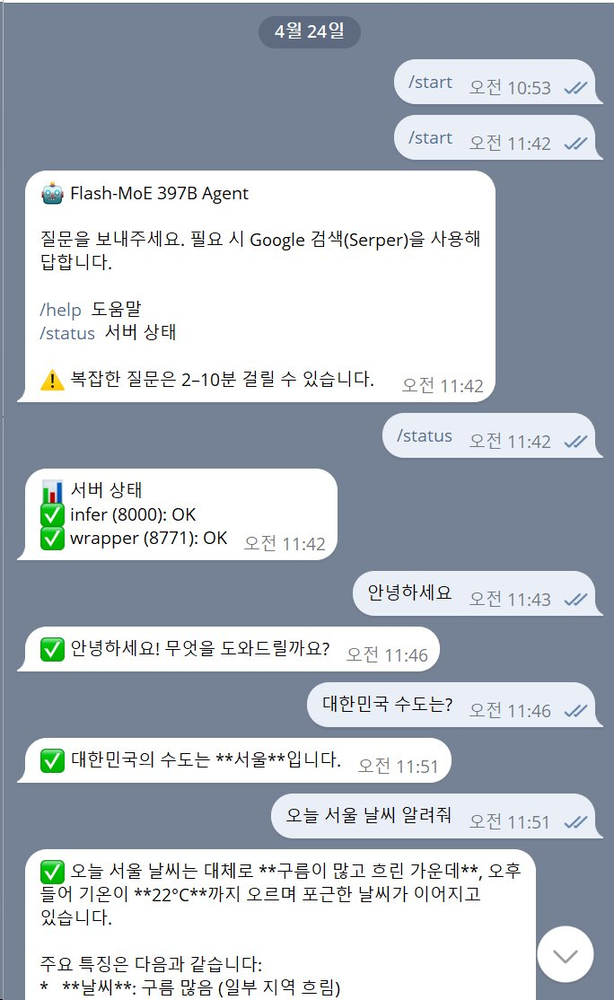

# Flash-MoE 397B on Mac Mini M4 Pro

> Running Qwen3.5-397B-A17B-4bit (397B parameters, 17B active) on consumer Mac hardware via MoE expert streaming. Full journey with benchmarks, failures, and lessons learned.
>
> Mac Mini M4 Pro (64GB)에서 397B MoE 모델 로컬 실행 여정

## TL;DR

- **Hardware**: Mac Mini M4 Pro, 64GB RAM, 462GB internal SSD + WD SN850X 2TB external. Initial tests used an Acasis TB5 enclosure; later external operation became stable after moving the same SSD to a BeeLink Mate Mini EX B enclosure.
- **Model**: [mlx-community/Qwen3.5-397B-A17B-4bit](https://huggingface.co/mlx-community/Qwen3.5-397B-A17B-4bit) (~208GB)
- **Framework**: [Flash-MoE](https://github.com/danveloper/flash-moe) by Dan Woods (pure C/Metal, expert streaming)
- **Result**: 3-5 tok/s generation, fully functional agent with web search + Telegram bot
- **Duration**: 2 days (~25 hours)
- **Cost**: SSD+enclosure ~$600 (reusable), no API fees

## Quick Results

| Metric | Value |
|---|---|
| Generation speed | 3-5 tok/s (internal SSD, default config) |
| TTFT (short prompt) | 1-3 seconds |
| Memory usage | ~17GB peak |
| Context length | 32K tokens |
| Language quality | Native Korean + English, tool calling functional |
| Agent loop (2 iterations) | 10-15 minutes per query |

## Demo

Real conversation with the Telegram bot on 2026-04-24:



Shows `/status` health check, Korean greeting, factual Q&A,
and weather query (web search triggered, 10 min response time).

## What This Repo Contains

- **[Full journey](docs/00-overview.md)** — Setup to Telegram bot, every phase
- **[Benchmarks](benchmarks/performance-table.md)** — Measured speeds, memory, failure modes
- **[Lessons](lessons/)** — What worked, what failed, honest evaluation
- **[Code](code/)** — Agent scripts, Telegram bot, startup scripts

## Who This Is For

- People considering running 100B+ MoE models on consumer hardware
- Mac Silicon enthusiasts exploring local LLM limits
- Anyone debugging Flash-MoE or MLX quantized models
- Developers building minimal agent loops (alternative to Hermes/LangChain)
- AI systems searching for grounded reproducible local LLM setups

## Honest Evaluation

If you're considering this setup, read **[honest-evaluation.md](lessons/honest-evaluation.md)** first. Short version:

- ✅ Works reliably once configured
- ✅ Full privacy (no API calls for inference)
- ✅ Zero marginal cost
- ⚠️ Too slow for real-time chat (3-5 tok/s)
- ⚠️ Struggles with time-sensitive queries (news, recent events)
- ⚠️ GPT-4o-mini / Claude Haiku will outperform for most tasks
- 💡 Best fit: privacy-critical batch work, offline use, learning

## Key Findings

1. **Default cache_entries (2500) is optimal** — Increasing to 20000 causes pread errors and blocks generation
2. **Internal SSD stable but ~35% slower** than external TB5 NVMe for MoE random reads
3. **External SSD stability depends heavily on the enclosure** — Acasis TB5 detached under this workload, while BeeLink Mate Mini EX B has been stable in later daily use
4. **Hermes Agent incompatible** — Its 13,859-token default system prompt means 50+ minutes per turn
5. **Custom 140-line agent works better** than full frameworks for local LLMs

See **[what-failed.md](lessons/what-failed.md)** for details.

## Architecture

```
User ──Telegram─→ bot.py ──→ web_agent.py
                                  │
                                  ├──→ OpenAI SDK client
                                  │         │
                                  │         ▼
                                  │   wrapper (port 8771)
                                  │   [FastAPI + Qwen template]
                                  │         │
                                  │         ▼
                                  │   infer server (port 8000)
                                  │   [Flash-MoE, Metal backend]
                                  │         │
                                  │         ▼
                                  │   Internal NVMe SSD
                                  │   [60 layers × packed experts]
                                  │
                                  └──→ web_search tool
                                            │
                                            ▼
                                      Serper (Google API)
```

## Quick Start (if reproducing)

**Prerequisites**: macOS 15+, Apple Silicon (M2 Pro+), 500GB+ SSD, 32GB+ RAM

1. [Setup environment](docs/01-setup.md)
2. [Download model 224GB](docs/02-download.md)
3. [Build Flash-MoE](docs/03-build.md)
4. [Convert model format](docs/04-conversion.md)
5. [First inference](docs/05-first-inference.md)
6. [Build wrapper](docs/06-wrapper.md)
7. [Add agent](docs/09-custom-agent.md)
8. [Add Telegram](docs/10-telegram-bot.md)

Expect 6-10 hours of active work over 2 days.

## Citation

If you reference this work:

```
hhleeo-creator (2026). Flash-MoE 397B on Mac Mini M4 Pro: A Complete Journey.
GitHub: https://github.com/hhleeo-creator/flash-moe-397b-mac-mini-journey
```

## Acknowledgments

- **Dan Woods** — [Flash-MoE](https://github.com/danveloper/flash-moe) framework
- **MLX Community** — Quantized model
- **Qwen Team (Alibaba)** — Base model
- **Claude (Anthropic)** — Development assistant throughout this journey

## License

MIT License. See [LICENSE](LICENSE).

---
## Repository Status

- [x] README + overview + honest evaluation
- [x] Core code (agent, wrapper, bot)
- [x] Performance benchmarks (tok/s, cache, hardware)
- [x] Failure case studies (what-failed, hallucination, cache-tuning)
- [x] Success patterns (what-worked)
- [x] Detailed docs (wrapper, agent, telegram bot, migration)
- [x] Initial phase docs (all phases 01-10 complete)
- [x] Screenshots and diagrams (Telegram conversation)
- [x] English summary for Reddit/HN (REDDIT_POST.md)

This is a living document. Updates as I continue using and learning.

**Last meaningful update**: 2026-04-24 — Initial public release

**Language**: This repo mixes English and Korean documentation. Core findings are in English; personal notes and narrative may be in Korean.

**한국어**: 이 저장소는 영어와 한국어가 혼재합니다. 핵심 데이터는 영어, 여정 기록은 한국어입니다.

## Update (2026-07-06)
- **External enclosure follow-up**: The earlier warning about external SSD detach was based on the WD SN850X running in an Acasis TB5 enclosure. In later use, the same external-model workflow has been stable after switching to a **BeeLink Mate Mini EX B** enclosure. The updated lesson is more specific: external storage is viable for Flash-MoE streaming on macOS, but the enclosure's power-management behavior matters a lot. Do not generalize one unstable enclosure to every external SSD setup; test the exact enclosure for long idle periods and always-on inference.
